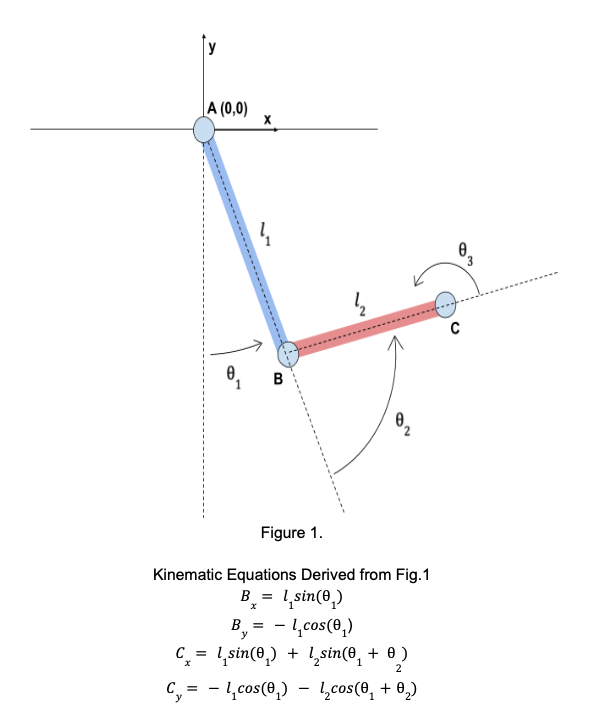

# Eyedropper SCARA Arm

A 3-DOF SCARA robot arm that places a dropper tip precisely above a target and
dispenses — built as a platform for learned (imitation-learning) control of
assistive manipulation.

> **Motivation.** The project started from a real problem: a family member needed
> eye surgery but couldn't have it, because applying post-op drops on a strict
> schedule required dexterity she didn't have and a caregiver who couldn't always
> be present. Low-cost, reliable assistive manipulation is a genuine unmet need.
> This arm is a research platform for exactly that class of task.



---

## Status

**Foundation complete.** The pieces below work today and are tested:

- **Kinematics** — forward, inverse (both elbow branches), joint-limit handling,
  and camera-orientation hold, derived from first principles and covered by a
  19-case `pytest` suite (FK spot checks, randomized IK round-trips, workspace
  guards).
- **Reproducible environment** — the entire ROS 2 toolchain is pinned in a
  `Dockerfile`, so the system builds identically on any machine.
- **ROS 2 IK service node** — subscribes to a Cartesian target
  (`geometry_msgs/Point`) and publishes the joint angles that reach it
  (`sensor_msgs/JointState`), using the tested kinematics.
- **Physical arm** — 3-DOF SCARA (metal links, wooden base, MG996R servos driven
  over a PCA9685), with an eye-in-hand camera and a spring-preload fix for
  servo-gear backlash. Driven today by a standalone smoothed-motion Cartesian
  teleop.

**In progress** — the learned-control pipeline:

- URDF description + RViz visualization
- ROS 2 hardware node (servo driver on the Raspberry Pi)
- Teleoperated data collection → LeRobot dataset
- Imitation-learning policy (ACT) → on-hardware deployment
- Evaluation protocol and failure-mode analysis

---

## Why this architecture

The IK node listens on `/target_point` and answers on `/joint_states`. It has no
idea *who* sends the target — a keyboard teleop, a scripted test, or a trained
policy all publish to the identical topic, and the node never changes. That
decoupling is deliberate: it's what lets a human operator and a learned policy
drive the arm through the same interface, which is the backbone of the
collect-demonstrations → train → deploy workflow this project is built around.

```
/target_point ──▶ [ ik_node ] ──▶ /joint_states ──▶ [ servo_node ] ──▶ arm
  (teleop or                                          (on the Pi)
   policy)
```

---

## Engineering notes

A few decisions worth calling out, because they reflect how the project was
actually reasoned through:

- **Kinematics built and tested from scratch**, not pulled from a library — closed-form
  2-link IK with explicit elbow-branch selection and joint-limit filtering, so
  every line is understood and defensible.
- **Workspace characterized before committing hardware** — reachable vs.
  *dexterous* (orientation-holdable) workspace computed analytically, plus a
  Yoshikawa manipulability analysis, to place the servo horns and the patient
  target zone in the best-conditioned region and avoid the full-extension
  singularity.
- **Backlash solved mechanically, not by spending money** — a spring preload on
  the gear train removes most of the MG996R play, a ~$0 fix that's reproducible
  by anyone building on hobby servos.
- **Python control node over `ros2_control`** — for a three-servo arm, a Python
  node against the standard `JointState` interface is the right complexity
  trade-off; the migration path to a `ros2_control` hardware interface is
  deliberately left open.

---

## Repository layout

```
eyedropper_ros2/
├── Dockerfile                     # pinned ROS 2 Jazzy environment
└── ros2_ws/
    └── src/
        └── eyedropper_control/
            ├── eyedropper_control/
            │   ├── kinematics.py  # tested FK / IK library
            │   └── ik_node.py     # Cartesian-target → joint-angle node
            ├── test/
            │   └── test_kinematics.py
            ├── package.xml
            └── setup.py
```

---

## Running it

The whole system runs inside the pinned container — no local ROS 2 install needed.

```bash
# build the environment
docker build -t scara:dev .

# start a container with the workspace mounted
docker run -it -v "$(pwd)":/workspace scara:dev bash
```

Inside the container:

```bash
cd /workspace/ros2_ws
colcon build --packages-select eyedropper_control
source install/setup.bash

# run the IK node
ros2 run eyedropper_control ik_node
```

In a second shell into the same container (`docker exec -it <name> bash`):

```bash
source /opt/ros/jazzy/setup.bash
source /workspace/ros2_ws/install/setup.bash

# send a target — the arm's home pose
ros2 topic pub --once /target_point geometry_msgs/msg/Point "{x: 75.0, y: -105.0}"
```

The node logs the joint solution:

```
(75, -105) -> sh 0.0  el 90.0  wr -90.0
```

Run the kinematics tests with:

```bash
python3 -m pytest ros2_ws/src/eyedropper_control/test/ -v
```

---

## Hardware

| Part | Detail |
|---|---|
| Structure | 3-DOF SCARA, metal links on a rigid wooden base |
| Link lengths | l₁ = 105 mm (shoulder→elbow), l₂ = 75 mm (elbow→tip) |
| Actuators | 3× MG996R servos via a PCA9685 16-channel PWM driver |
| Compute | Raspberry Pi (hardware I/O), workstation (control + training) |
| Sensing | Eye-in-hand camera (OV5647) for target tracking |

---

## License

Apache-2.0